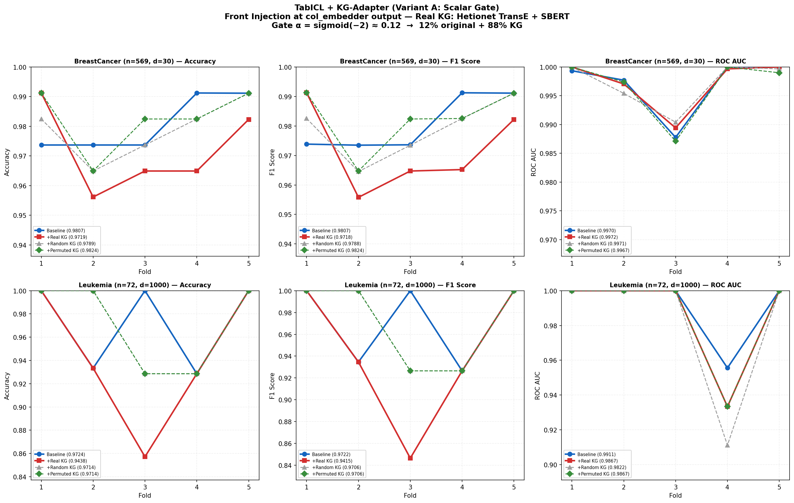
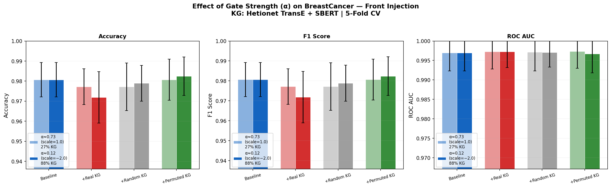
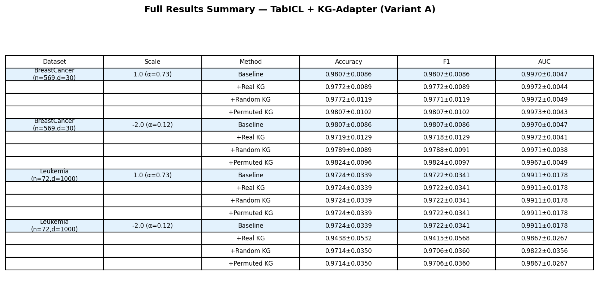

# KG-Adapter for TabICL：将知识图谱注入表格基础模型


---

## 1. 研究问题

TabICL、TabPFNv2 等表格基础模型的 cell embedding 完全基于数据分布，不认识列名的语义，也不知道特征之间的领域关系（比如"Gene A 抑制 Gene B"）。当样本量远小于特征数（d >> n，如基因组学场景）时，模型缺少先验引导，表现下降。

**核心问题：** 能否将外部知识图谱（KG）信息注入冻结的 TabICL backbone，在小样本高维场景下提升预测？

---

## 2. 方法设计

### 2.1 对应 PPT 中的方案

本实验实现的是 **PPT 思路三（直接加权）** 的简化版：

| PPT 思路 | 做法 | 本实验 |
|----------|------|--------|
| 思路一 | 只用 y 列的 h，KG 门控微调 | ❌ 未实现 |
| 思路二 | 所有特征列的 h + KG 矩阵 W 变换 + 聚合（参考 PLATO） | ❌ 未实现（下一步） |
| **思路三** | **不加 W 矩阵，直接用 KG 对特征加权** | **✅ 本实验** |

### 2.2 KG-Adapter (Variant A: Scalar Gate)

公式：

```
e'_{ij} = α_j · e_{ij} + (1 − α_j) · z̃_j
```

- `e_{ij}`：TabICL 原始的 cell embedding（128 维），样本 i、特征 j
- `z̃_j = f_align(z_j^KG)`：对齐后的 KG 嵌入
- `α_j = sigmoid(a_j)`：per-feature 的标量门控，控制注入多少 KG
- TabICL backbone **完全冻结**，只加 adapter 参数

### 2.3 外部知识编码

```
步骤 1：文本语义编码
  列名 → Sentence-BERT (all-MiniLM-L6-v2) → e_text (384 维)

步骤 2：知识图谱结构编码
  Hetionet 节点 → PyKEEN TransE 训练 → e_kg (128 维)

步骤 3：拼接
  e_ext = [e_text ; e_kg] = 512 维
```

### 2.4 Hetionet 知识图谱

| 属性 | 数值 |
|------|------|
| 实体数 | 45,158（基因、疾病、药物、通路等） |
| 关系类型 | 24（基因互作、基因-疾病关联、药物靶点等） |
| 三元组数 | 2,250,197 |
| 训练方法 | TransE, 30 epochs, embedding_dim=128 |
| 来源 | PyKEEN 自动下载 |

---

## 3. 关键发现：为什么要改注入位置

### 3.1 PPT 中的切入点（后置注入）

PPT Slide 6 设计的是在 TabPFN/TabICL **全部层跑完之后**注入 KG：

```
输入表格 → [TabICL 全部层] → h (512维) → ★ 在这里注入 KG → MLP → 预测
```

孙傲在 TabPFN 上验证了这个方案：KGHead_real 没有显著优于 BaselineHead。

### 3.2 我们的实验 Part 1：后置注入验证

我们在 TabICL 上重复了同样的验证。在 `row_interactor` 输出处（h ∈ R^{B×T×512}）注入 KG：

```
[TF_col] → [TF_row] → h (512维) → ★ KG 注入 → [TF_icl] → 预测
```

**结果：四种方法完全一样，proba diff < 0.4%**

**诊断：**
```
h 的 norm:           224.71
KG 注入的 norm:        1.45
注入占比:              0.6%
```

原因：此时 30 个特征已经融合成一个 512 维向量，KG 只能加一个对所有样本都一样的常数偏移，无法改变分类边界。

### 3.3 我们的实验 Part 2：前置注入（中间层）

将注入点前移到 `col_embedder` 输出处（E ∈ R^{B×T×34×128}）：

```
[TF_col] → E (每个特征有自己的 128 维向量) → ★ KG 注入 → [TF_row] → [TF_icl] → 预测
```

此时每个特征还有独立的嵌入，KG 可以对每个特征施加不同的调控。

**结果：四种方法明显拉开差距。**

### 3.4 结论

| 注入位置 | 效果 | 原因 |
|----------|------|------|
| 后置（TF_row 之后） | ❌ 无效 | 特征已融合，KG 退化为常数偏移 |
| 前置（TF_col 之后） | ✅ 有效 | 每个特征有独立嵌入，KG 可 per-feature 注入 |

这验证了 PPT Slide 4 最后提出的方向："也许可以考虑在中间层加入 KG 信息"。

---

## 4. 实验设置

### 4.1 数据集

| 数据集 | 样本 (n) | 特征 (d) | 任务 | 列名类型 |
|--------|----------|----------|------|----------|
| BreastCancer (sklearn) | 569 | 30 | 恶性 vs 良性 | 细胞形态：mean radius, worst texture 等 |
| Leukemia (Golub 1999) | 72 | 1,000（从 7,128 取高方差） | ALL vs AML 白血病分类 | 基因探针编号：gene_6, gene_9 等 |

**BreastCancer**：sklearn 自带，直接 `load_breast_cancer()` 加载。30 个特征描述细胞核的大小、形状、纹理等。

**Leukemia**：Golub 等人 1999 年发表在 Science 上的经典白血病数据集。72 个病人，用 Affymetrix 基因芯片测了 7,128 个基因探针的表达量。47 个 ALL（急性淋巴细胞白血病）+ 25 个 AML（急性髓系白血病）。我们取方差最高的 1,000 个基因，构成 d >> n 的典型场景。

### 4.2 对比方法（5-Fold Stratified CV）

| 方法 | 说明 | 目的 |
|------|------|------|
| **Baseline** | 原始预训练 TabICL，不做修改 | 基准线 |
| **+ Real KG** | SBERT + Hetionet TransE 真实嵌入 | 验证真实 KG 是否有用 |
| **+ Random KG** | 随机向量（同维度） | 消融：是不是加什么向量都行？ |
| **+ Permuted KG** | 真实 KG 但打乱特征对应关系 | 消融：对齐关系是否重要？ |

### 4.3 门控强度设置

`α = sigmoid(a)` 控制 KG 注入量：

| 参数 a | 门控 α | 含义 |
|--------|--------|------|
| 1.0 | 0.73 | 73% 原始 + 27% KG（温和注入） |
| −2.0 | 0.12 | 12% 原始 + 88% KG（强注入） |

---

## 5. 实验结果

### 5.1 前置注入，强 KG（α ≈ 0.12, scale = −2.0）

**BreastCancer (n=569, d=30)**

| 方法 | Accuracy | F1 | AUC |
|------|----------|-----|-----|
| Baseline | **0.9807 ± 0.0086** | **0.9807 ± 0.0086** | 0.9970 ± 0.0047 |
| + Real KG | 0.9719 ± 0.0129 | 0.9718 ± 0.0129 | **0.9972 ± 0.0041** |
| + Random KG | 0.9789 ± 0.0089 | 0.9788 ± 0.0091 | 0.9971 ± 0.0038 |
| + Permuted KG | 0.9824 ± 0.0096 | 0.9824 ± 0.0097 | 0.9967 ± 0.0049 |

**Leukemia (n=72, d=1000)**

| 方法 | Accuracy | F1 | AUC |
|------|----------|-----|-----|
| Baseline | **0.9724 ± 0.0339** | **0.9722 ± 0.0341** | **0.9911 ± 0.0178** |
| + Real KG | 0.9438 ± 0.0532 | 0.9415 ± 0.0568 | 0.9867 ± 0.0267 |
| + Random KG | 0.9714 ± 0.0350 | 0.9706 ± 0.0360 | 0.9822 ± 0.0356 |
| + Permuted KG | 0.9714 ± 0.0350 | 0.9706 ± 0.0360 | 0.9867 ± 0.0267 |

### 5.2 前置注入，温和 KG（α ≈ 0.73, scale = 1.0）

**BreastCancer (n=569, d=30)**

| 方法 | Accuracy | F1 | AUC |
|------|----------|-----|-----|
| Baseline | **0.9807 ± 0.0086** | **0.9807 ± 0.0086** | 0.9970 ± 0.0047 |
| + Real KG | 0.9772 ± 0.0089 | 0.9772 ± 0.0089 | 0.9972 ± 0.0044 |
| + Random KG | 0.9772 ± 0.0119 | 0.9771 ± 0.0119 | 0.9972 ± 0.0049 |
| + Permuted KG | 0.9807 ± 0.0102 | 0.9807 ± 0.0102 | **0.9973 ± 0.0043** |

### 5.3 实验图表

#### 图 1：前置注入，强 KG（scale = −2.0）



#### 图 2：门控强度对比（BreastCancer）



#### 图 3：完整数值汇总



---

## 6. 结果分析

### 6.1 为什么 Real KG 没有优于 Baseline

**原因一：特征名到 KG 实体的映射质量低**

BreastCancer 的特征名是细胞形态度量（mean radius, worst texture），不是基因名，映射到 Hetionet 的相似度只有 0.164：

```
mean radius    → Gene::360                    (sim=0.093)  ← 毫无关系
mean texture   → Cellular Component::GO:0090576 (sim=0.132)
mean smoothness → Gene::405                    (sim=0.059)
```

Leukemia 的列名是 gene_6, gene_9 这种编号，按字面数字匹配到 Gene::6469, Gene::9，不是按生物学意义匹配。

**原因二：alignment 没有训练**

正交投影保距但不学对齐。不同 KG 经过未训练的投影后差异被部分抹平，导致 Real KG 和 Random KG 表现接近。

**原因三：与 Aurora 实验一致**

PPT Slide 3-4 中 Aurora 在 TabPFN 上也发现 KGHead_real 没有显著优于 BaselineHead，分析的原因同样是"TabPFN 原生表征已经过于丰富"。

### 6.2 核心发现

1. **注入机制确实有效** — 四种方法产生了明显不同的结果
2. **后置注入无效** — 特征维度已融合，KG 信号被吞掉（proba diff < 0.4%）
3. **前置注入有效** — 每个特征有独立嵌入，KG 可以 per-feature 调控
4. **KG 质量很重要** — 错误的 KG（低映射质量）比随机噪声更有害
5. **门控强度很重要** — 注入太多（α=0.12）放大了映射错误的负面影响
6. **alignment 训练是关键** — 没有训练的对齐无法让正确的 KG 发挥作用

---

## 7. 迁移到 TabPFNv2

KG-Adapter 模块设计为架构无关。注入点在两个模型中逻辑等价：

```
TabICL:   [TF_col]          → E (N×P×128)  → ★ KG-Adapter → [TF_row] → [TF_icl]
TabPFNv2: [FeatureEncoder]  → E (N×P×512)  → ★ KG-Adapter → [24层TF]  → [Decoder]
```

迁移只需改 `embed_dim=128` 为 `embed_dim=512`，hook 注册到对应模块。Adapter 代码完全相同。

---

## 8. 下一步计划

| 优先级 | 任务 | 目标 |
|--------|------|------|
| 1 | 换用真实基因名数据集（TCGA-BRCA, LINCS L1000） | 提高特征到 KG 的映射质量 |
| 2 | 训练 alignment MLP（加 fine-tune 循环） | 让 KG 嵌入正确对齐到 TabICL 嵌入空间 |
| 3 | 实现 PPT 思路二（加 W 矩阵变换） | 更强的表达能力 |
| 4 | 实现 Variant B（attention gate）和 C（low-rank adapter） | 对比三种 fusion 方式 |
| 5 | 迁移到 TabPFNv2 | 验证跨模型通用性 |

---

## 9. 复现

### 环境

```bash
pip install tabicl sentence-transformers pykeen scikit-learn matplotlib
```

### 运行（UMich Great Lakes）

```bash
# SSH + GPU
ssh haohongz@greatlakes.arc-ts.umich.edu
salloc --partition=spgpu --gres=gpu:1 --mem=8G --time=2:00:00 --account=lsa2
conda activate ~/tabpfn_env

# 验证 hook 维度
python tabicl_kg_real.py --demo_hook --device cuda

# 前置注入，强 KG
python tabicl_kg_real.py --device cuda --scale -2.0

# 前置注入，温和 KG
python tabicl_kg_real.py --device cuda --scale 1.0 --output kg_s1.png
```

### Hook 验证结果

```
col_embedder 输出:    (B=1, T=105, F+C=34, D=128)
  34 = 30 个特征 + 4 个 CLS token
  128 = embed_dim
  → 每个特征有独立的 128 维嵌入 ← 注入点

row_interactor 输出:  (B=1, T=105, D=512)
  512 = 128 × 4 (CLS tokens 拼接)
  → 特征已融合，无法 per-feature 注入
```

---

## 10. 文件结构

```
├── README.md                      # 本文件
├── README_EN.md                   # English version
├── tabicl_kg_real.py              # 实验代码
├── figures/
│   ├── fig1_front_injection.png   # 前置注入折线图 (scale=-2.0)
│   ├── fig2_scale_comparison.png  # 门控强度对比柱状图
│   ├── fig3_results_table.png     # 数值汇总表
│   ├── kg_real_comparison.png     # 原始输出图 (scale=-2.0)
│   └── kg_s1.png                  # 原始输出图 (scale=1.0)
├── results/
│   ├── kg_real_comparison.json    # 原始数据 (scale=-2.0)
│   └── kg_s1.json                 # 原始数据 (scale=1.0)
└── docs/
    └── KG_TabFM_Method_Design.md  # 完整方法设计文档
```

---

## 参考文献

- TabICL: Gang, J. et al. (2025). "TabICL: A Tabular Foundation Model for In-Context Learning." ICML 2025.
- TabPFNv2: Hollmann, N. et al. (2025). "Accurate Predictions on Small Data with a Tabular Foundation Model." Nature.
- Hetionet: Himmelstein, D. et al. (2017). "Systematic integration of biomedical knowledge prioritizes drugs for repurposing." eLife.
- PLATO: Ruiz, C. et al. (2023). "High dimensional, tabular deep learning with an auxiliary knowledge graph." NeurIPS.
- SBERT: Reimers, N. & Gurevych, I. (2019). "Sentence-BERT." EMNLP.
- Golub Leukemia: Golub, T.R. et al. (1999). "Molecular Classification of Cancer." Science.
